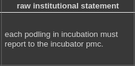
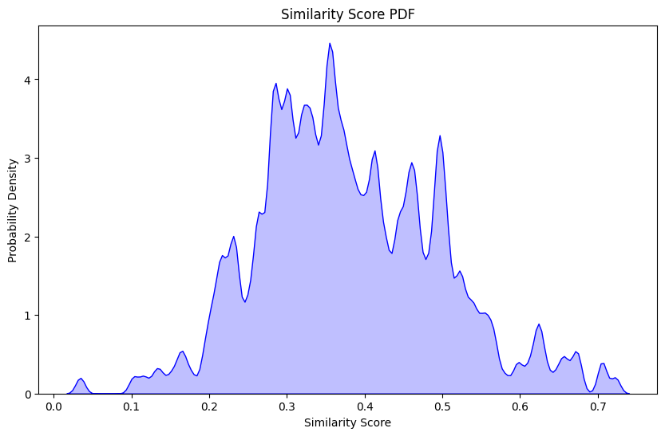
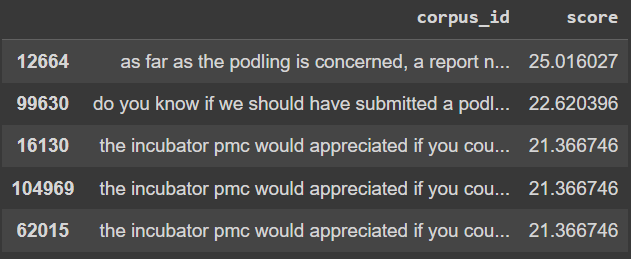
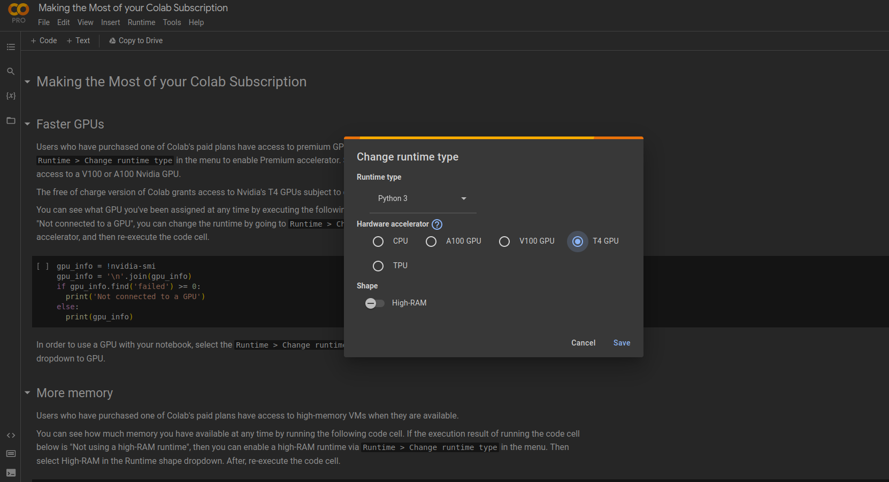

The repository was developed and is being maintained by the C^2 lab at the University of California Davis. It presents pipelines and applications to support empirical policy analysis at scale, and builds off an extensive survey of relevant tasks and functionalities in natural language processing. 

# Contents

1. Recommended pipelines and applications
2. Navigating Colaboratory 
3. Tasks Overview

# Recommended pipelines and applications

The repository is a joint effort led by <INSERT Labs/Organizations involved>. We present an extensive, curated collection of  functionalities and tasks in natural language processing, adapted to aid collective action research at scale. 

Our Github currently hosts 5 (more soon!) versatile end to end applications. Each of these can be used alone or in combinations to process raw policy corpus and extract meaningful information and measurements for research and analysis. Examples include but not limited to:

* **Identify community players, strength of regulation and interactions:** Preprocess documents > Extract ABDICO components > Network Analysis
* **Policy diffusion/adaption over time:** Preprocess policy documents > Compare policies with interviews/conversations
* **Compare Institutions:** Preprocess policy documents from different communities > Find most similar rules between two communities
* **Power dynamics in communities:** Preprocess policy documents > Extract ABDICO components > cluster actors > Analyze inter group leverage

# Navigating Colaboratory

Colaboratory or Colab is a service provided by Google, which allows users to run and develop notebook applications while leveraging their infrastructure at very little cost.
## Overview of Colab subscription plans:

* Free : Nvidia T4 GPU
* Pro ($9.99/month) : Nvidia T4/ V100/ A100 + High RAM CPU. Check website for unit rate charges for different GPUs and their features.

For most notebooks here however, **users should not require premium subscriptions**. A free T4 GPU generally suffices, unless the specific use case involves high volumes (hundreds of MBs to several GBs) of text data and necessitates more compute/speed.

# Tasks Overview

## General Guidelines
      
* There are broadly two types of notebooks
	* Implementing Elinor Ostrom's Institutional Grammar Framework
	* Exploring governances through policies
   
* All input files to notebooks must be .csv. If your data is in any other formal (xls/json), please make sure to convert appropriately before running a notebook.
* Check comments in each notebook to understand how input data should be configured, i.e. upload file name, table headers/input data fields/output data fields.
* When coding raw institutional statements for some notebooks (e.g. ABDICO_parsing.ipynb, policies_compares, etc ), for interpretability as well as best results, it's recommended to present data in self contained statements with most IG components present than bullets.

      E.g. "The Board should 1. conduct a vote every 3 years 2. review proposal for budgetary considerations"... can be coded as separate row entries such as:
      
      "The Board should conduct a vote every 3 years."
      
      "The Board should review proposal for budgetary considerations."

      
## Institutional Grammar Framework

### Preprocessing/Anaphora Resolution (ABDICO_coreferences.ipynb)

Performs disambiguation of pronouns in policy documents or passages to resolve the absolute entity they are referring to.
This preserves valuable information by identifying the exact individuals, groups or organizational instruments associated with different activities and contexts.
Anaphora Resolution is recommended as a precursor preprocessing step to policy texts.

**Input** : main.csv file where rows are passages/sections of policy documents (Best practice : language models have text limits. For best results, limit passages to 4 - 5 sentences. For even longer documents, break them down to such appropriate segments in each .csv row)

**Output** : All individual sentences from the policy documents/sections after their anaphora resolution

**Example** : After anaphora resolution, it becomes clear and specific that "them" in the policy refers to Podling websites

      Before:
            Statement: "there are restrictions on where podlings can host their websites and what branding they can use on them."
            Attribute : "Podlings" (observing restrictions)
            Objects : "their websites", "them"

      After Anaphora resolutions:
            Statement: "there are restrictions on where podlings can host their websites and what branding podlings can use on their websites"
            Attribute : "Podlings" (observing restrictions)
            Objects : "their websites", "their websites"

### Institutional Grammar Parsing (ABDICO_parsing.ipynb)

Uses a linguistic task called semantic role labeling and maps their outputs to the Institutional Grammar (ABDICO) schema. Currently supports extractions of Attributes, Objects, Deontics and Aims.

**Input** : main.csv file where rows are raw institutional statements. These could be human coded policy statements or outputs from the anaphora resolution notebook (see previous task)

**Output** : Extracted Attribute, Object, Deontic and Aim

### Categorizing Institutional Components (ABDICO_clustering.ipynb)

Semantic clustering and categorizing of dominant actors, resources and activities. Helps identify related and frequent activities, levels of regulation, and distribution of power and responsibilities across roles in an institution.

**Input** : main.csv file where columns contain a policy's "Attribute", "Object", "Deontic" and "Aim" respectively. These could be human annotations or outputs from the ABDICO parsing notebook

**Output** : Inferred categories (indicated by topic) for Attribute, Object, Deontic and Aim.

## Policy Search Engines

### Institutional Comparison (policy_comparison.ipynb)

The Policy Comparison Code Notebook is a tool that provides **comparative insight into the policies across two different institutions**. Regardless of the specific domain, this code notebook follows a series of steps to provide a deep understanding of the similarities between these policies and visualize the results.

1. **Input:** The notebook takes two sets of policy sentences databses in .csv format as input. These sets can be in the form of text files or data structures, depending on how you choose to implement it.

2. **Comparison:** The code conducts an "all-to-all" comparison. This means that every statement in the first file is compared to every statement in the second file. For example, if the first file has 10 statements, and the second has 15, the code will perform 150 pairwise comparisons in total.

3. **Output:** A downloadable file with the results of these comparisons are stored with three columns:
   - The statement from the first file.
   - The statement from the second file.
   - A numerical similarity score that quantifies how similar or dissimilar each pair of statements is. This score helps users gauge the degree of similarity between policy statements.

To enhance the user's understanding of the data, the code provides three visualizations:

1. **Distribution of Similarity Scores:** This visualization offers a view of how pairwise similarity scores are distributed. It helps users identify trends, such as how often and to what degree institutions tend to be more similar or dissimilar.

2. **Word Cloud:** A word cloud visually represents the most frequently occurring words in each policy set. It offers a quick and intuitive way to identify prominent terms and themes within the policies.

While the code is initially designed to work with example datasets, it can be easily adapted to analyze and visualize user-provided policy data. This versatility makes it a valuable tool for comparing and understanding policy documents across various domains, facilitating data-driven decision-making and insights.

### Institutional Evolution (policy_explore.ipynb)

Institutional Evolution pursues **how policies diffuse, as in how they are invoked, interpreted and reinterpreted by a governed community** . The policy_explore.ipynb notebook is designed to compare an "institutional statement" (the "needle") to entries from a large corpus of performative discourse (the "haystack"), such as email communications, deliberations, interviews, user posts, dicussion threads or tweets, etc. It utilizes natural language processing techniques to score and retrieve exchanges from the haystack or searchbase, and rank them in terms of resemblance to the "query" institutional statement. 

The notebook is essentially a search engine, to be used to retrieve and analyze the most related conversations pertaining to community governance. Moreover, degrees of resemblance between the policy being queried and day to day operations and interactions, as indicated by the match score, reflects how practical relevance of an existing rule varies between different groups, application arenas over even across time. 

While institutional comparision deals with policies against policies, this notebook matches a policy with longer texts (email/tweets etc.). This is refered to as **asymmetric search** in information retrieval. 

- **Input Data:** This notebook requires two sets of data:
  1. The "needle" or Query: A single institutional statement that you want to query the corpus with.
  2. The "haystack" or Searchbase: Community discourse. A potentially large collection of emails, deliberations, interviews, user posts, dicussion threads/tweets, etc.

- **Query Process:** The notebook performs the following tasks:
  - Queries the corpus with an institutional statement ("needle").
  - Calculates the semantic similarity between the "needle" and each text in the "haystack."

- **Output Data:** The notebook generates a downloadable file with a dataframe with two columns:
  1. Texts from the searchbase that are most similar to the query.
  2. The numerical similarity score, quantifying how similar texts are to the query.

- **Customization:** While the notebook comes with a default dataset for demonstration, users can easily replace it with their own pair of datasets to perform custom comparisons. The notebook provides insights into the methods used, such as semantic similarity, semantic search, BM25Okapi, and transformer-based word embeddings. You are encouraged to explore https://huggingface.co/sentence-transformers for different biencoder models to run your policy search engine!

## Getting Started

1. Download this repository (compressed zip) to your local system
      
2. Extract downloaded file. Notebook applications end in a '.ipynb' extension. 

3. Go to https://colab.research.google.com/. Upload your selected notebook from the repo as shown

4. Set notebook backend. Select Runtime (Upper left header). Make sure you are opting for a GPU and using Python 3.

5. Run first cell of each notebook for installations and package imports

6. Follow inline instructions to run the remaining notebook cells one by one

7. Download the final file with the results (Generally "main.csv") from right hand directory panel.

For further understanding of the Colab environment (How cells work, how to run cells, etc) [refer to this link](https://youtu.be/inN8seMm7UI?si=NpsCUBWeQM9W7kW8)

**IF YOU FACE TECHNICAL PROBLEMS IN IMPLEMENTATION/QUESTIONS ABOUT THE NOTEBOOKS, PLEASE POST AN ISSUE DESCRIBING YOUR PROBLEM ON GITHUB**

# *Citations*

This library is the fruit of contributions (data and code) from multiple collaborators. We acknowledge the support of Co-NSF #1917908 ("RCN: Coordinating and Advancing Analytical Approaches for Policy Design"), NSF GCR #2020751 ("GCR: Jumpstarting Successful OSS Projects With Evidence Based Rules and Structures") as well as the [Institutional Grammar Research Initiative](https://institutionalgrammar.org/) and the [Computational Institutional Science Lab](cisl.info).

If you use this library, please cite:

Additionally, depending on the application you incorporate in your work, please also cite the amazing NLP research which made it possible:

* **For policy search engines:**

Reimers, N., & Gurevych, I. (2019). Sentence-bert: Sentence embeddings using siamese bert-networks. arXiv preprint arXiv:1908.10084.

Chakraborti, M., Atkisson, C., Stanciulescu, S., Filkov, V., & Frey, S. (2023). Do We Run How We Say We Run? Formalization and Practice of Governance in OSS Communities. arXiv preprint arXiv:2309.14245. 

* **For SRL based IG parsing:**

Shi, P., & Lin, J. (2019). Simple bert models for relation extraction and semantic role labeling. arXiv preprint arXiv:1904.05255.

Chakraborti, M., Atkisson, C., Stanciulescu, S., Filkov, V., & Frey, S. (2023). Do We Run How We Say We Run? Formalization and Practice of Governance in OSS Communities. arXiv preprint arXiv:2309.14245. 

* **For coreference resolution in policy:**

Lee, K., He, L., & Zettlemoyer, L. (2018). Higher-order coreference resolution with coarse-to-fine inference. arXiv preprint arXiv:1804.05392.

* **For topic modeling:**

Grootendorst, M. (2022). BERTopic: Neural topic modeling with a class-based TF-IDF procedure. arXiv preprint arXiv:2203.05794.

Reimers, N., & Gurevych, I. (2019). Sentence-bert: Sentence embeddings using siamese bert-networks. arXiv preprint arXiv:1908.10084.

**Data Sources:**

* Apache Incubator Policies : Sen, A., Atkisson, C., & Schweik, C. (2022). Cui Bono. International Journal of the Commons, 16(1), 64-77.
* Apache Incubator emails : Yin, L., Chen, Z., Xuan, Q., & Filkov, V. (2021, August). Sustainability forecasting for apache incubator projects. In Proceedings of the 29th ACM Joint Meeting on European Software Engineering Conference and Symposium on the Foundations of Software Engineering (pp. 1056-1067).
* Food Policies : 
* Economic Council Policies : 

**Supporting Libraries**

* Huggingface
* AllenAI
