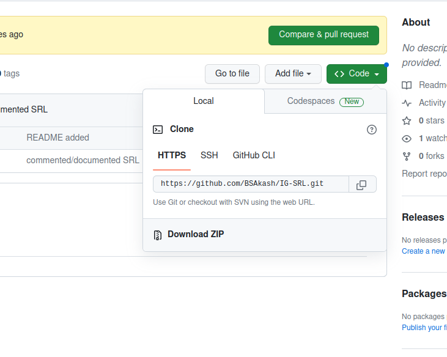
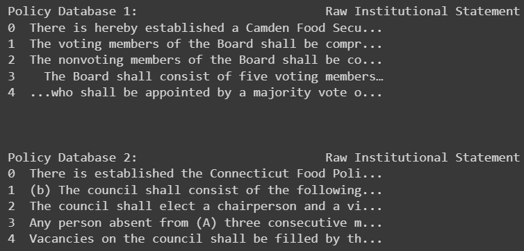
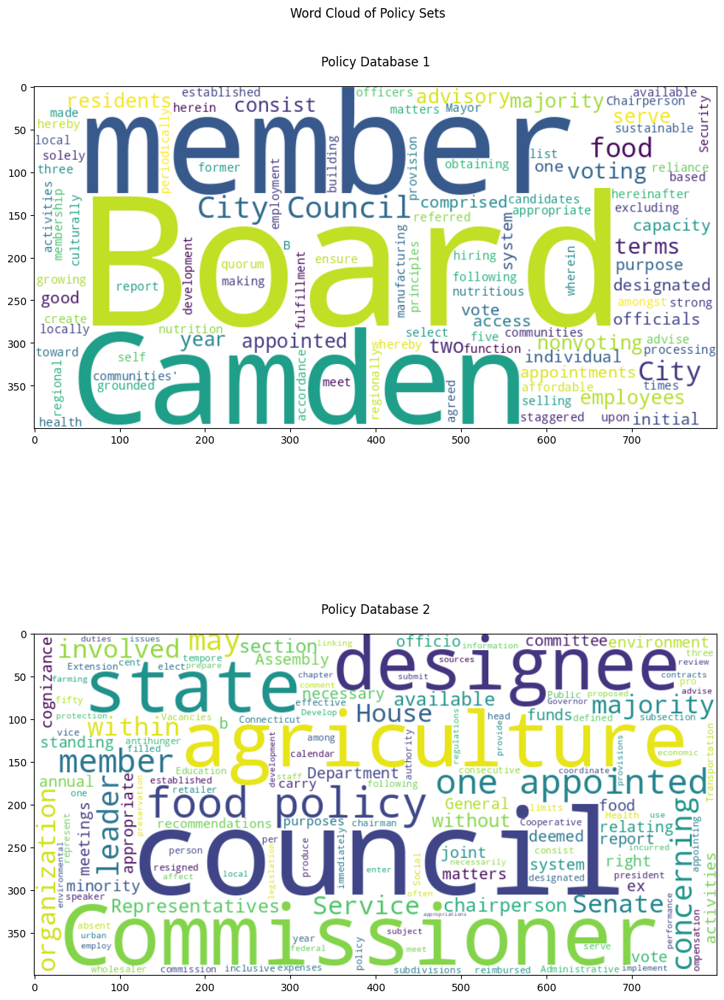
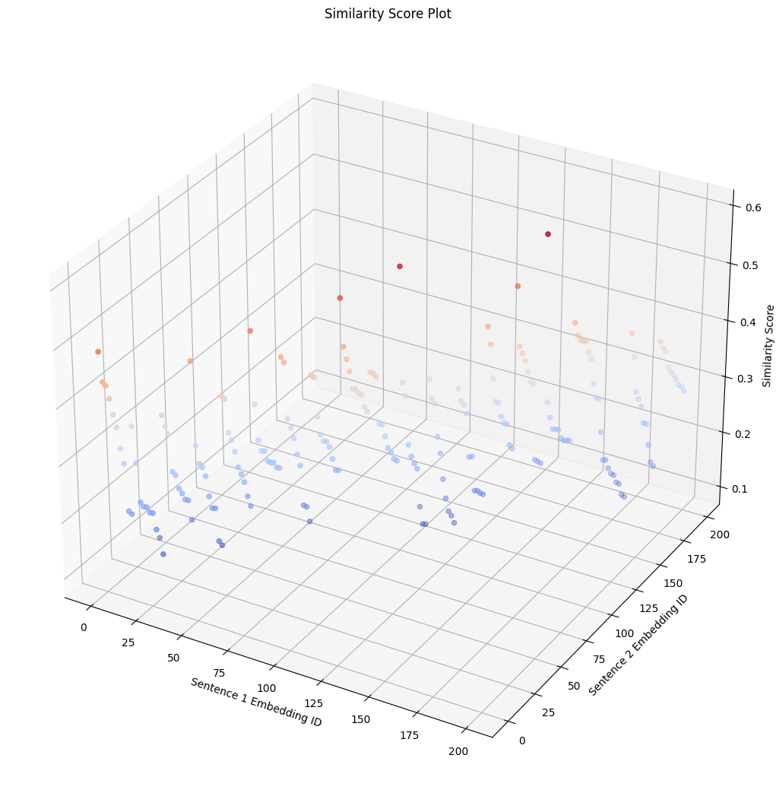
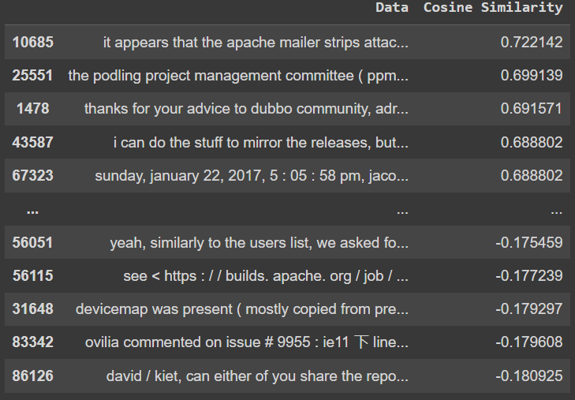

# Contents

1. Recommended pipelines and applications
2. Navigating Colaboratory 
3. Tasks Overview

# Recommended pipelines and applications

The repository is a joint effort led by <INSERT Labs/Organizations involved>. We present an extensive, curated collection of  functionalities and tasks in natural language processing, adapted to aid collective action research at scale. 

Our Github currently hosts 5 (more soon!) versatile end to end applications. Each of these can be used alone or in combinations to process raw policy corpus and extract meaningful information and measurements for research and analysis. Examples include but not limited to:

* **Identify community players, strength of regulation and interactions:** Preprocess documents > Extract ABDICO components > Network Analysis
* **Policy diffusion/adaption over time:** Preprocess policy documents > Compare policies with interviews/conversations
* **Compare Institutions:** Preprocess policy documents from different communities > Find most similar rules between two communities
* **Power dynamics in communities:** Preprocess policy documents > Extract ABDICO components > cluster actors > Analyze inter group leverage

# Navigating Colaboratory

Colaboratory or Colab is a service provided by Google, which allows users to run and develop notebook applications while leveraging their infrastructure at very little cost.
## Overview of Colab subscription plans:

* Free : Nvidia T4 GPU
* Pro ($9.99/month) : Nvidia T4/ V100/ A100 + High RAM CPU. Check website for unit rate charges for different GPUs and their features.

For most notebooks here however, users should not require premium subscriptions. A free T4 GPU generally suffices, unless the specific use case involves high volumes (hundreds of MBs to several GBs) of text data and necessitates more compute/speed.

## Getting Started

1. Download this repository (compressed zip) to your local system
      
2. Extract downloaded file. Notebook applications end in a '.ipynb' extension. 

3. Go to https://colab.research.google.com/. Upload your selected notebook from the repo as shown

4. Set notebook backend. Select Runtime (Upper left header). Make sure you are opting for a GPU and using Python 3.

5. Run first cell of each notebook for installations and package imports

6. Follow inline instructions to run the remaining notebook cells one by one

7. Download the final file with the results (Generally "main.csv") from right hand directory panel.

For further understanding of the Colab environment (How cells work, how to run cells, etc) : https://youtu.be/inN8seMm7UI?si=NpsCUBWeQM9W7kW8

# Tasks Overview

## General Guidelines

* All input files to notebooks must be .csv. If your data is in any other formal (xls/json), please make sure to convert appropriately before running a notebook.
* Check comments in each notebook to understand how input data should be configured, i.e. upload file name, table headers/input data fields/output data fields.
* When coding raw institutional statements for some notebooks (e.g. ABDICO_parsing.ipynb, policies_compares, etc ), for interpretability as well as best results, it's recommended to present data in self contained statements with most IG components present than bullets.

      E.g. "The Board should 1. conduct a vote every 3 years 2. review proposal for budgetary considerations"... can be coded as separate row entries such as:
      
      "The Board should conduct a vote every 3 years."
      
      "The Board should review proposal for budgetary considerations."

### Preprocessing/Anaphora Resolution (ABDICO_parsing.ipynb)

Performs disambiguation of pronouns in policy documents or passages to resolve the absolute entity they are referring to.
This preserves valuable information by identifying the exact individuals, groups or organizational instruments associated with different activities and contexts.
Anaphora Resolution is recommended as a precursor preprocessing step to policy texts.

Input : .csv file where rows are passages/sections of policy documents (Best practice : language models have text limits. For best results, limit passages to 4 - 5 sentences. For even longer documents, break them down to such appropriate segments in each .csv row)

Output : All individual sentences from the policy documents/sections after their anaphora resolution

Example: After anaphora resolution, it becomes clear and specific that "them" in the policy refers to Podling websites

      Before:
            Statement: "there are restrictions on where podlings can host their websites and what branding they can use on them."
            Attribute : "Podlings" (observing restrictions)
            Objects : "their websites", "them"

      After Anaphora resolutions:
            Statement: "there are restrictions on where podlings can host their websites and what branding podlings can use on their websites"
            Attribute : "Podlings" (observing restrictions)
            Objects : "their websites", "their websites"

### Institutional Grammar Parsing (ABDICO_coreferences.ipynb)

Uses a linguistic task called semantic role labeling and maps their outputs to the Institutional Grammar (ABDICO) schema. Currently supports extractions of Attributes, Objects, Deontics and Aims.

Input : .csv file where rows are raw institutional statements. These could be human coded policy statements or outputs from the anaphora resolution notebook (see previous task)

Output : Extracted Attribute, Object, Deontic and Aim

# Policy Comparison Code Notebook

### Policy Comparison (policy_comparison.ipynb)

## Overview

The Policy Comparison Code Notebook is a tool that allows you to conduct a comprehensive analysis of policy sentences from two different sets. Regardless of the specific domain, this code notebook follows a series of steps to provide a deep understanding of the similarities between these policies and visualize the results.

## How It Works

1. **Input:** The notebook takes two sets of policy sentences databses in .csv format as input. These sets can be in the form of text files or data structures, depending on how you choose to implement it.

2. **Comparison:** The code conducts an "all-to-all" comparison. This means that every statement in the first file is compared to every statement in the second file. For example, if the first file has 10 statements, and the second has 15, the code will perform 150 pairwise comparisons in total.

3. **Output:** A downloadable file with the results of these comparisons are stored with three columns:
   - The statement from the first file.
   - The statement from the second file.
   - A numerical similarity score that quantifies how similar or dissimilar each pair of statements is. This score helps users gauge the degree of similarity between policy statements.

To enhance the user's understanding of the data, the code provides three visualizations:

1. **Distribution of Similarity Scores:** This visualization offers a view of how similarity scores are distributed across the dataset. It helps users identify trends, such as whether policies tend to be more similar or dissimilar.

2. **Word Cloud:** A word cloud visually represents the most frequently occurring words in the policy statements. It offers a quick and intuitive way to identify prominent terms and themes within the policies.

3. **3D Plot:** This 3D scatter plot displays policy statements as data points in a 3D space. The x and y coordinates correspond to the IDs of the statements, while the z-axis represents the similarity scores. This plot allows users to explore how policies relate to each other in a multidimensional space.

While the code is initially designed to work with example datasets, it can be easily adapted to analyze and visualize user-provided policy data. This versatility makes it a valuable tool for comparing and understanding policy documents across various domains, facilitating data-driven decision-making and insights.

# Semantic Search Code Notebook

### Policy Explore (policy_explore.ipynb)

## Overview

The Semantic Search Code Notebook is designed to compare an "institutional statement" (the "needle") with a potentially large corpus of formal or informal institutional statements (the "haystack") from various domains. It utilizes natural language processing techniques to identify and return the most similar statements from the haystack in relation to the given institutional statement and returns close matches of the query policy statement .

## Functionality

- **Input Data:** This notebook requires two sets of data:
  1. The "needle": A single institutional statement that you want to query the corpus with.
  2. The "haystack": A potentially large collection of formal or informal institutional statements.

- **Query Process:** The notebook performs the following tasks:
  - Queries the corpus with the institutional statement ("needle").
  - Calculates the numerical similarity between the "needle" and each statement in the "haystack."

- **Output Data:** The notebook generates a downloadable file with a dataframe with two columns:
  1. Statements from the "haystack" that are most similar to the "needle."
  2. The numerical similarity score, quantifying how similar each statement is to the "needle."

- **Customization:** While the notebook comes with a default dataset for demonstration, users can easily replace it with their own pair of datasets to perform custom comparisons. The notebook provides insights into the methods used, such as semantic similarity, semantic search, BM25Okapi, and transformer-based word embeddings.

